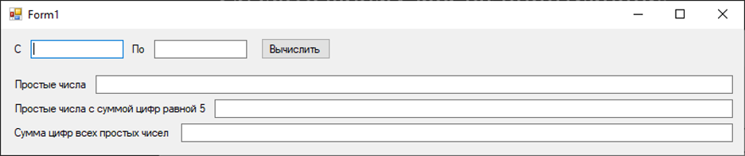
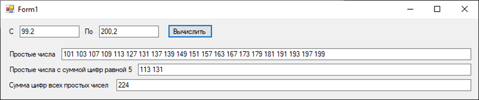

Тестовой задание(WinFormsc#, для теста на Java можно сделать аналогичную форму).

Создать форму как на принтскрине.

После заполнения полей «С» и «ПО» и нажатия кнопки «Выполнить», должны заполниться три нижних поля или выдаваться сообщения о некорректном вводе полей «С» и «ПО».

